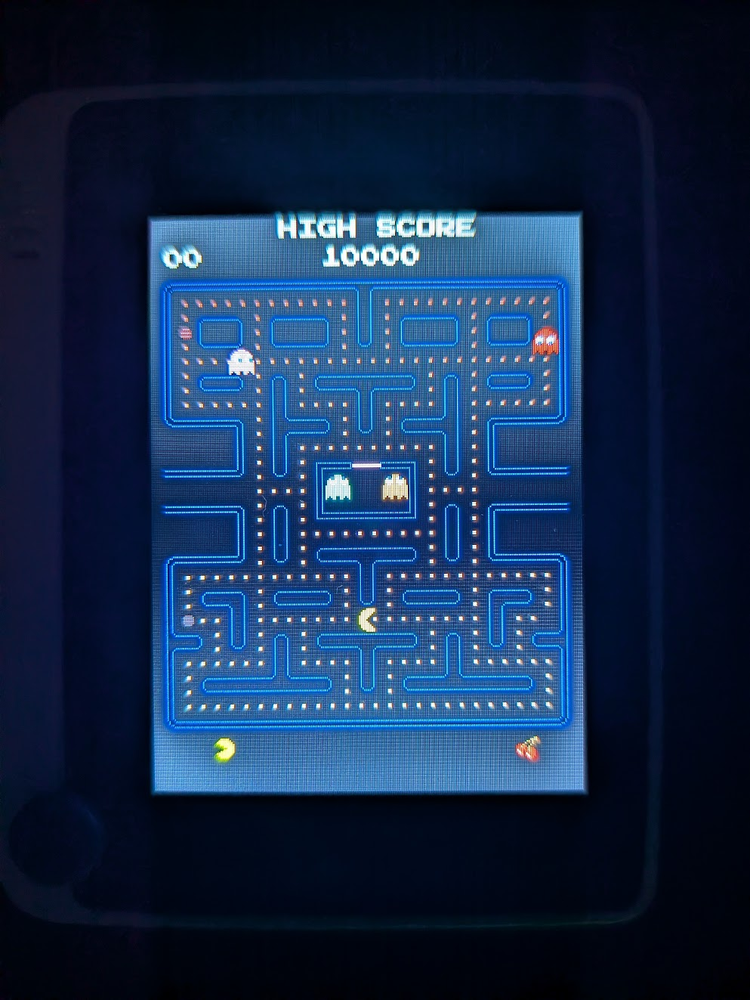
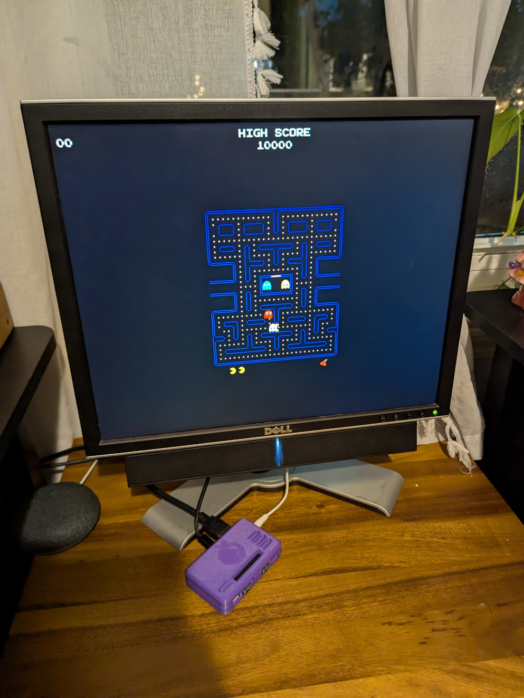

# 🕹️ Pac-Man Clone for Seeed Wio Terminal and Adafruit Fruit Jam

A pixel-perfect Pac-Man clone built for the **Seeed Wio Terminal** and **Adafruit Fruit Jam** using **CircuitPython 10**.

| Seeed Wio Terminal | Adafruit Fruit Jam |
|--------------------|--------------------|
|  |  |

---

## ✨ Features

- 🎮 **Authentic Gameplay** - Classic Pac-Man mechanics including ghost AI, power pellets, and frightened mode
- 👻 **Four Unique Ghosts** - Blinky, Pinky, Inky, and Clyde with arcade-accurate behavior patterns
- 🍒 **Bonus Fruits** - Cherry, strawberry, orange, apple, and more appear as you progress
- 🔊 **Sound Effects** - Waka-waka eating sounds, death melody, and startup jingle via the built-in buzzer
- 📊 **Scoreboard** - Arcade-style display with 1UP, HIGH SCORE, lives, and current level fruit
- 🎨 **Custom Font** - Press Start 2P retro arcade font
- ⚡ **Optimized Performance** - Runs smoothly on the Wio Terminal's limited resources

---

## 🎯 Gameplay

| Control | Action |
|---------|--------|
| Joystick | Move Pac-Man |
| Button 1 | Toggle Sound On/Off |

### Scoring
| Item | Points |
|------|--------|
| Dot | 10 |
| Power Pellet | 50 |
| Ghost (1st) | 200 |
| Ghost (2nd) | 400 |
| Ghost (3rd) | 800 |
| Ghost (4th) | 1600 |
| Cherry | 100 |
| Strawberry | 300 |
| Orange | 500 |
| Apple | 700 |
| Melon | 1000 |
| Galaxian | 2000 |
| Bell | 3000 |
| Key | 5000 |

---

## 🛠️ Hardware Requirements

- **[Seeed Wio Terminal](https://www.seeedstudio.com/Wio-Terminal-p-4509.html)**
  - ATSAMD51P19 (ARM Cortex-M4F @ 120MHz)
  - 192 KB RAM
  - 2.4" LCD (320x240, used in portrait mode: 240x320)
  - Built-in 5-way joystick
  - Built-in buzzer
- **[Adafruit Fruit Jam](https://www.adafruit.com/product/6200)**
  - RP2350B dual 150MHz Cortex M33 microcontroller
  - 8 MB PSRAM
  - DVI video output on the HSTX port (landscape and portrait mode supported depending on display resolution)
  - USB keyboard input
  - I2S stereo headphone + mono speaker output

---

## 📦 Installation

### 1. Install CircuitPython 10

Download and install CircuitPython 10.x for [Wio Terminal](https://circuitpython.org/board/seeeduino_wio_terminal/) or [Fruit Jam](https://circuitpython.org/board/adafruit_fruit_jam/).

### 2. Install Required Libraries

Copy these libraries from the [Adafruit CircuitPython Bundle](https://circuitpython.org/libraries) to your `CIRCUITPY/lib/` folder:

- `adafruit_bitmap_font/` (folder)
- `adafruit_display_text/` (folder)
- For **Adafruit Fruit Jam**:
  - `adafruit_imageload/` (folder)
  - `adafruit_fruitjam/` (folder)

### 3. Copy Game Files

Copy the entire contents of this repository to your `CIRCUITPY` drive:

```
CIRCUITPY/
├── code.py
├── fonts/
│   └── press_start_2p.bdf
├── images/
│   ├── maze_empty.bmp
│   └── sprites.bmp
└── lib/
    ├── adafruit_bitmap_font/
    └── adafruit_display_text/
```

Additional file structure for **Adafruit Fruit Jam**

```
CIRCUITPY/
└── lib/
    ├── adafruit_imageload/
    └── adafruit_fruitjam/
```

#### Fruit Jam OS (**Adafruit Fruit Jam** only)

This application also supports installation within [Fruit Jam OS](https://learn.adafruit.com/fruit-jam-os). Install it using the same principles above but instead of using `CIRCUITPY/` as the root directly, it can be installed into `CIRCUITPY/apps/` and then opened from the launcher application.

### 4. Play!

The game starts automatically when you plug in the device. Enjoy! 🎮

---

## 🎨 Technical Details

### Display
- Original Pac-Man: 224x288 pixels
- Wio Terminal: 240x320 pixels (portrait mode)
- Game area is centered with a small border

### Ghost AI
Each ghost has unique targeting behavior:
- **Blinky (Red)** - Directly chases Pac-Man
- **Pinky (Pink)** - Targets 4 tiles ahead of Pac-Man
- **Inky (Cyan)** - Complex targeting using Blinky's position
- **Clyde (Orange)** - Chases when far, scatters when close

### Ghost Modes
- **Scatter** - Ghosts retreat to corners
- **Chase** - Ghosts actively pursue Pac-Man
- **Frightened** - Blue ghosts flee (can be eaten)
- **Eaten** - Eyes return to ghost house

---

## 🤖 Built with AI Assistance

This project was developed with assistance from **GitHub Copilot** (Claude) in VS Code. The entire game was built iteratively through conversation, from basic sprite rendering to full arcade-accurate gameplay.

---

## 📜 Credits

- **Pac-Man** is a trademark of Bandai Namco Entertainment Inc.
- This is a fan-made educational project, not for commercial use
- [Press Start 2P Font](https://fonts.google.com/specimen/Press+Start+2P) by CodeMan38
- Built for the amazing [CircuitPython](https://circuitpython.org/) community

---

## 📄 License

This project is provided for educational purposes. See [LICENSE](LICENSE) for details.

---

## 🙏 Special Thanks

- [Adafruit](https://adafruit.com/) for CircuitPython and incredible learning resources
- [Seeed Studio](https://www.seeedstudio.com/) for the Wio Terminal
- The [Pac-Man Dossier](https://www.gamedeveloper.com/design/the-pac-man-dossier) for detailed game mechanics documentation

---

*Made with 💛 and lots of dots*
